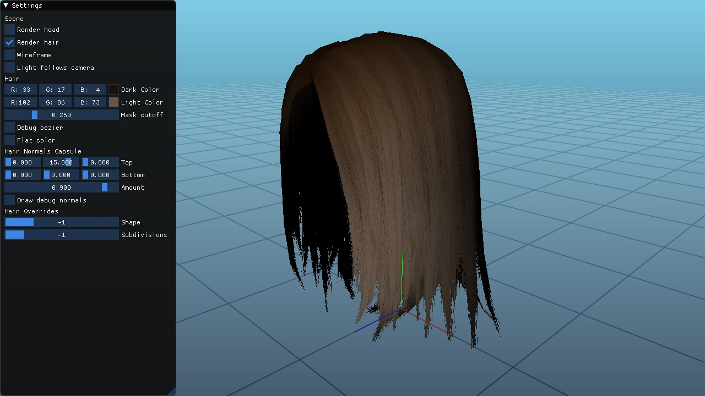
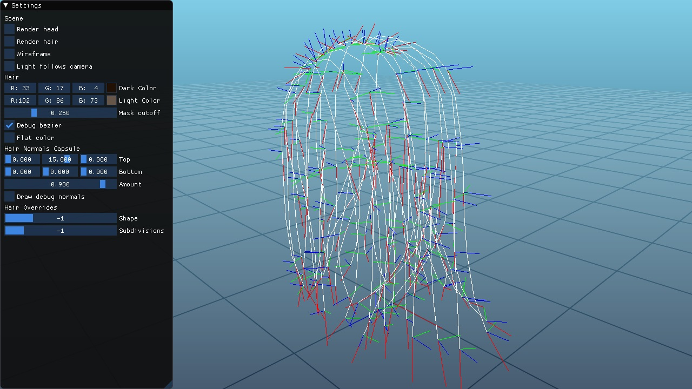
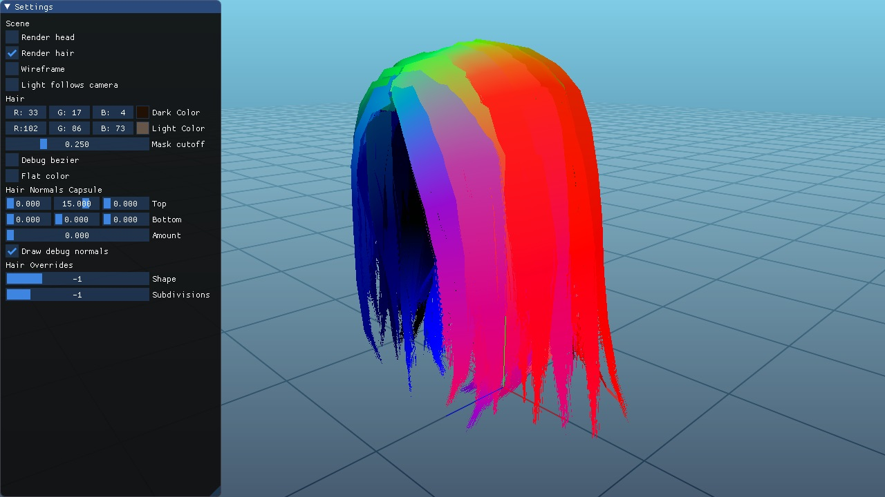
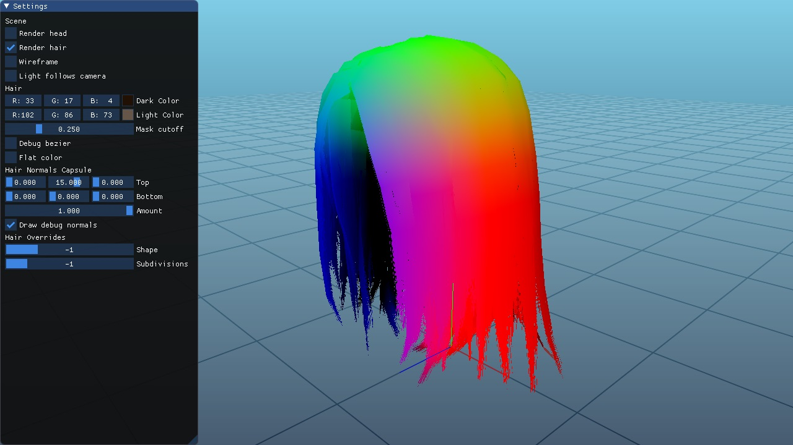

# Hair generation using geometry shaders

Created by Denny Lindberg for the course TSBK03: Advanced Game Programming. This was a project for generating hair planes from curve data with Geometry Shaders. Curves are designed in Maya and then exported as a text file. It is then loaded inside the application.

**Result**

**Input Bezier Curves**

**Typical surface normals**

**Bent normals enabled (for a unified softer appearance)**

# Features

- C++17
- For Windows (Visual Studio 2019)
- OpenGL 4.6

# Building the code

Get **premake5** for generating makefiles or solutions for your IDE - https://premake.github.io/download.html

After downloading the executable, place it in the root folder. Run `premake5 vs2019` in the terminal or command line to generate a Visual Studio 2019 solution (the solution ends up in the temp folder). Open the solution and you're good to go.

# Third party content used

**Sparrow from Paragon by Epic Games** - Borrowed the head mesh and hair textures for testing.

# Third party libraries used

**glad** for OpenGL bindings - https://github.com/Dav1dde/glad

**SDL2** for creating a cross-platform OpenGL window with input - https://www.libsdl.org

**glm** for vector and matrix data types compatible with OpenGL - https://glm.g-truc.net/0.9.9/index.html

**lodepng** for loading and saving PNG files - https://lodev.org/lodepng/

**tinyobjloader** for loading obj files - https://github.com/syoyo/tinyobjloader

**Dear ImGUI** for the UI - https://github.com/ocornut/imgui

# Algorithms copied or referenced
**Various GLSL noise algorithms** - Copied: https://gist.github.com/patriciogonzalezvivo/670c22f3966e662d2f83

**Evan's grid shader** - Slightly modified: http://madebyevan.com/shaders/grid/

## Folder structure

**binaries/** - contains compiled executable, dlls, images, configs or audio. (screenshots end up here)

**content/** - mesh, curves, textures and shader files.

**include/** - thirdparty includes.

**libs/** - windows specific libs.

**source/** - main folder for source code.

**temp/** - this folder is generated by premake5 and contains the solution. This folder can be deleted at any time.